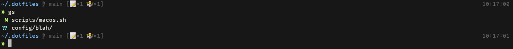

# ashokm does dotfiles

Your dotfiles are how you personalize your system. These are mine.

**Warning:** If you want to give these dotfiles a try, you should first fork this repository, review the code, and remove things you don’t want or need. Don’t blindly use my settings unless you know what that entails. Use at your own risk!

### Setup

#### Connect to GitHub with SSH

* See [https://help.github.com/articles/connecting-to-github-with-ssh/](https://help.github.com/articles/connecting-to-github-with-ssh/)

#### Install Xcode Command Line Tools

```bash
xcode-select --install
```

### Install

```bash
git clone git@github.com:ashokm/dotfiles.git ~/.dotfiles
cd ~/.dotfiles
./bootstrap.sh --install
```

This will symlink the files in `~/.dotfiles/dotfiles` to your home directory.
Everything is configured and tweaked within `~/.dotfiles`.

### Specify the `$PATH`

If `~/.path` exists, it will be sourced along with the other files, before any feature testing takes place.

Here’s an example `~/.path` file that adds `/usr/local/bin` to the `$PATH`:

```bash
export PATH="/usr/local/bin:$PATH"
```

### Add custom commands

If `~/.extra` exists, it will be sourced along with the other files. You can use this to add a few custom commands without the need to fork this entire repository, or to add commands you don’t want to commit to a public repository.

My `~/.extra` looks something like this (and I use `githome` and `gitwork` aliases to switch between home and work email addresses):

```bash
# Git credentials
GIT_AUTHOR_NAME="Ashok Manji"
GIT_COMMITTER_NAME="$GIT_AUTHOR_NAME"
git config --global user.name "$GIT_AUTHOR_NAME"

GIT_HOME_EMAIL="home.username@company.com"
GIT_WORK_EMAIL="work.username@company.com"
GIT_AUTHOR_EMAIL="$GIT_HOME_EMAIL"
GIT_COMMITTER_EMAIL="$GIT_HOME_EMAIL"
git config --global user.email "$GIT_HOME_EMAIL"

GITREVIEW_USERNAME="Ashok.Manji"
git config --global gitreview.username "$GITREVIEW_USERNAME"
```

### Sensible macOS defaults

When setting up a new Mac, you may want to set some sensible macOS defaults:

```bash
./scripts/macos.sh
```

### Uninstall

```bash
cd ~/.dotfiles
./bootstrap.sh --uninstall
rm -rf ~/.dotfiles
```

### Screenshots



### TODO

* Create `helper.sh` to include helper functions for log and error usage in bash scripts to prevent duplication in scripts

## Thanks to…

A decent amount of the code in these dotfiles stem or are inspired from the below projects.

* [Mathias Bynens](https://github.com/mathiasbynens/dotfiles)
* [Zach Holman's](https://github.com/holman/dotfiles)
